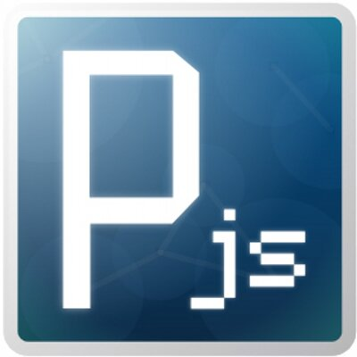
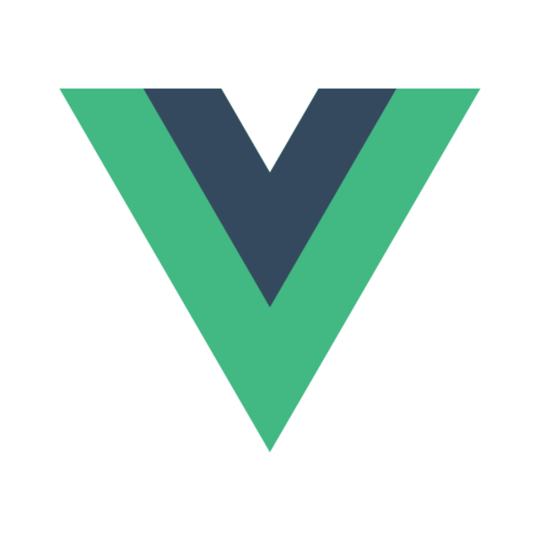

<html>
    <head>
        <title> Rose Dufresne </title>
        <link rel="stylesheet" href="styles.css">
    </head>

    <body>
        

        
            
 
                
            

            

                
 Rose Dufresne 

                    

                        
<a href="CV-english.pdf"> CV </a>

                        
<a href="index.html"> Home </a>

                        
<a href="projects.html"> Projects </a>

                        
<a href="https://github.com/RoseDuf">GitHub</a>

                    

            

        

        

            <h3 class="header"> Introduction </h3>
            

                
 
                I am a fourth year student majoring in Computer Science and minoring in Game Design at Concordia University. Being a person that is always interested in learning new skills and determined at completing challenges to the best of my ability, I am very interested in pursuing any opportunity to expand my knowledge in my field.
                

                

                During my experience at Concordia University, I've learned to appreciate many aspects of computer science over the years. For example, I loved my course on theoretical computer science where I got to learn how turing machines worked and how computers interpreted different grammars. I also enjoyed data structures and algorithms because it was satisfying for me to see different sorting algorithm's effectiveness at play. Furthermore, I've gained a particular interest in computer graphics. In fact, so much so that I would love to pursue a job that is closely related to computer graphics in the near future.
                

                

                Thanks to my game design minor, I also had the opportunity to combine the very technical aspects of computer science with art! I have always been a very artistic person and I absolutely didn't want to let my talents go to waste, which is why I am very interested in creating games. It perfectly combines the mathematical and logical aspects of computer science with art, something that is very hard to find in professional fields.
                

                
  
                When it comes to programming, one of my competences is my ability to learn new programming languages and softwares very quickly. Before applying to my major, I had no previous knowledge in coding. However, it only took me a couple of months to finally catch up to the standards of the classes I was taking, and even exceeded other students in my program.
                

            

        

        

            

            <h3> Education </h3>
            

                

                    

                        Concordia University, Montreal, QC
                    

                    

                        (from 2016 until now)
                    

                

                

                    

                        
GPA: 3.11

                    

                

                

                    

                        <u>Game Design Minor</u>
                    

                    

                        Relevant courses I have taken:
                    

                    <ul>
                        <li>Introduction to Game Design - CART 215</li>
                        <li>3D Digital Production - CART 361</li>
                        <li>Computation Arts I - CART 253</li>
                        <li>Introduction to Game Development - COMP 376</li>
                    </ul>  
                

            
                

                

                    

                        <u>Computer Applications Major (BCompS)</u>
                    

                    

                        Relevant courses I have taken:
                    

                    <ul>
                        <li>Object-Oriented Programming I, II - COMP 248, COMP 249</li>
                        <li>Data Structures and Algorithms - COMP 352</li>
                        <li>Web Programming - SOEN 287</li>
                        <li>Introduction to Software Engineering - COMP 354</li>
                        <li>Introduction to Theoretical Computer Science - COMP 335</li>
                        <li>Computer Graphics - COMP 371 </li>
                        <li>Databases - COMP 353 </li>
                        <li>Advanced Program Design with C++ - COMP 345 </li>
                        <li>Combinatorics - COMP 339</li>
                        <li>Elementary Numerical Methods - COMP 361</li>
                    </ul>  
                

                

                    

                        <u> Courses I am currently taking OR going to take this year</u>
                    

                    

                        Relevant courses:
                    

                    <ul>
                        <li>Animation for Computer Games - COMP 477</li>
                        <li>Artificial Intelligence - COMP 472</li>
                        <li>Game Studio I - CART 415</li>
                    </ul>  
                

            
 <!-- end of edu color class -->
            
 <!-- end of edu-grid class -->

            

                <h3> Employement </h3>

                        

                            Software Engineering Internship
                        

                        

                            Matrox, Video Department
                        

                        

                            (from January 6th 2020 until now)
                        

                        

                            Participating in the development and maintenance of Matrox’s cross-platform video software components using C++.
                        

                        <ul>
                            <li>
                            Gained experience working with video software, notably their Topology Builder application which facilitates the process of video streaming or broadcasting on multiple monitors. 
                            </li>
                            <li>
                            Learned about H264 encoding and decoding and have added a feature to their codec that gives the ability to force IDR frames at any given moment in a video which restarts a new group of pictures (GOP).
                            </li>
                            <li>
                            Writing automation test scripts using Powershell to ensure good quality of their products. 
                            </li>
                        </ul> 
            

<!--
            

                

                    

                        Currently learning how to use:
                    
 
                

            

--> <!-- end of learning class -->

        
 <!-- end of education class -->

        

            <h3>Skills</h3>
            

                

                    Programming languages:
                

            

            

                

                    
                

                

                    <h4>Java:</h4> 
                    
Experienced with java as I've been using it for many of my core classes at Concordia University, as well as using it for Matrox's TopologyBuilder UI which is an application which facilitates the process of video streaming or broadcasting on multiple monitors. 

                

            

            

                

                    
                

                

                    <h4>C++:</h4> 
                    
 
                    Used C++ to create a recreation of the boardgame "PowerGrid" in my "Advanced Program Design with C++" class and to make a successful Ray-Tracing program for my "Computer Graphics" class. Both projects of which I am very proud of. Also used C++ during my Matrox internship. For example, I added a feature to their codec that gives the ability to force IDR frames at any given moment in a video which restarts a new group of pictures (GOP).
                    

                

            

            

                    

                        
                    

                    

                        <h4>Python:</h4> 
                        

                        Used Python for Elementary Numerical Methods and have used it for 2 hackothon projects for ConUhacks IV and V. One of these projects being a lyric player for Octave Group's music player API and the other being a website to analyse different trends of music choices from TouchTunes jukeboxes across the country. Focused on movie releases, deaths and anniversaries of singers and bands. This second project we won!!!
                        

                    

            

            

                    

                        
                    

                    

                        <h4>C#:</h4> 
                        

                        Used C# for making games, as this is the backend programming language used in the Unity Engine.
                        

                    

            

            

                

                    
                

                

                    <h4>Javascript:</h4> 
                    

                    Used it for my web programming class and for the creation of the "Zorkemon" group project (which can be found on my github page), as well as the ConUHacks API challenge sponsored by TouchTunes.
                    

                

            

            

                

                    
                

                

                    <h4>Prolog:</h4> 
                    
Used it the most for helping in the creation of the "Zorkemon" card parser

                

            

            

            

            

                

                    
                    

                    <h4>MySQL/SQL</h4> 
                    

                

            

            

                

                    
                    

                    <h4>C</h4> 
                    

                

            

            

                

                    
                    

                    <h4>Ruby</h4> 
                    

                

                
            

            

                

                    
                    

                    <h4>CLisp</h4> 
                    

                

            

            
 <!-- end of group class -->

        

            

                Game Design/Development:
            

        

        

                    

                        
                    

                    

                        <h4>Unity:</h4> 
                        

                        Used Unity for many of the games I have made in the past couple of months. You can find such projects by clicking in the "Projects" option in the menu at the top of this page.
                        

                    

        

        

            

                
            

            

                <h4>OpenGL:</h4> 
                
 Used OpenGl to get first hand experience of Computer Graphics. Learned how
                    to use callback functions using the GLM library, how to implement vector and fragment shaders that can be modified in the graphics pipeline of the GPU, how to use VAOs, VBOs and EBOs, how to compute realistic lighting such as Phong and Gouraud lighting methods, and finally, I learned how to compute shadows and textures. 
                

            

        

        

            

                
            

            

                <h4>Processing:</h4> 
                
Used this software for the making of my game "Chicken Rush"

            

        

        

            

                
            

            

                <h4>Blender:</h4> 
                
3D modeling and animation software used for making my "Monster Bat" project

            

        

        

            

                Web Development:
            
 
        

        

            

                
            

            

                <h4>HTML, CSS, Javascript:</h4> 
                
Fair amount of experience with these basic web development tools. For instance, I used them to make this website!

            

        

        

            

                
            

            

                <h4>Vue.js:</h4> 
                
Used vue.js to make the frontend and UI of the "Zorkemon" project

            

        

        

            

                
            

            

                <h4>PHP:</h4> 
                
Used this language for my database project

            

        

        

            

                Tools:
            

        

        

            

                

                    
                    

                    <h4>Git</h4> 
                    

                

            

            

                

                    
                    

                    <h4>Powershell</h4> 
                    

                

            

            

                

                    
                    

                    <h4>Ubuntu</h4> 
                    

                

            

            

                

                    
                    

                    <h4>Bash</h4> 
                    

                

            

        
 <!-- end of groupOf4 class -->

        
 <!-- end of skills class -->

    </body>

</html>
