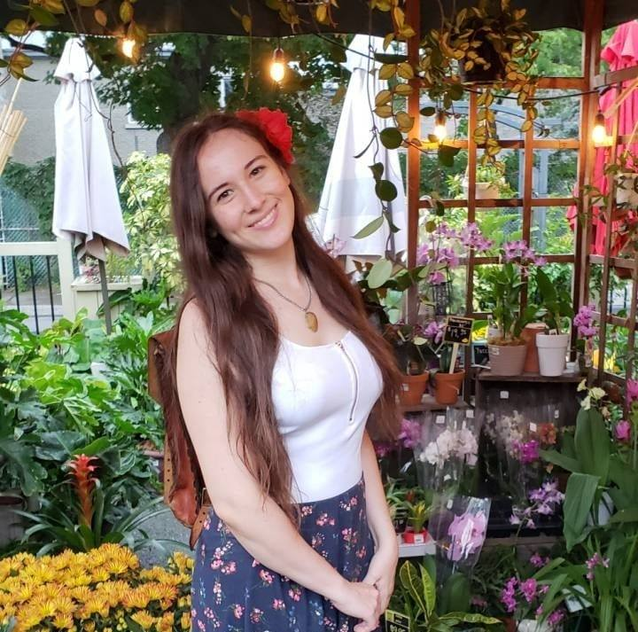

<html>
    <head>
        <title> Projects </title>
        <link rel="stylesheet" href="styles.css">
    </head>

    <body>
        

        
            
 
                
            

            

                
 Rose Dufresne 

                    

                        
<a href="CV-english.pdf"> CV </a>

                        
<a href="index.html"> Home </a>

                        
<a href="projects.html"> Projects </a>

                        
<a href="https://github.com/RoseDuf">GitHub</a>

                    

            

        

        

            

                <h3> Projects </h3>
                
 I would like to share with you some interesting projects and things I've learnt over the years 

            

            

                

                    

                    <h4> Super Shopper: Closing Time Rush </h4>
                    
(Made using Unity and C#)

                

                

                    Super Shopper: Closing Time Rush (SSCTR) is a wacky maze-like arcade action game that has the player running around a store buying items in order to complete a shopping list whilst taking advantage of coupons and avoiding obstacles and enemies. While the primary goal is to complete your shopping list, other items and coupons appear in the level which contribute to your score. There is also a time limit for each level, making it important to avoid the many obstacles and enemies which stun or hinder the player, causing them to lose time. There is a minimum score for each level that must be reached in order to unlock more levels.
                
 
                

                    To look at the game design document, click  <a href="gdd.pdf"> here </a>. 
                
 
                
                

                    To download and play the game, click <a href="https://ctrl-alt-defeat.gitlab.io/supershopperctr/"> here </a>.
                

            
 <!-- end of proj-11 -->

            

                

                    <iframe width="480" height="270" src="https://www.youtube.com/watch?v=4VeVlD5qbJI">
                    </iframe>

                    <h4> Treasure Diver 2 </h4>
                    
(Made using Unity and C#)

                

                

                    Second game I made using Unity. In this variation, you play in first person perspective in a 3D environment. This time, you found gold at the bottom of a deep sewer filled with mutated sharks. You can carry a bag of meat to distract the sharks. Why would you want to do this? Because if you have 15 points worth of gold, or more, sharks will start following you to try to hurt you! There is also a giant sea spider that spawns at the bottom, that can shoot projectiles at you. The goal is the same: get the most gold possible and bring it back up to you boat without dying.
                
 
                <!--
                

                    To download and play, click  <a href="https://roseduf.itch.io/treasure-diver"> here </a>. 
                
 
                -->
                <!--
                

                    For the technical part of this project, click  <a href="powergrid.html"> here </a> for more. 
                
 
                -->

            
 <!-- end of proj-22 -->

            

                

                    <iframe width="480" height="270" src="https://www.youtube.com/watch?v=BmGUNQDGLlM">
                    </iframe>

                    <h4> Treasure Diver </h4>
                    
(Made using Unity and C#)

                

                

                    First game I made using Unity. This is a 2D variation of Balloon Fight. In this variation, rather than being set in air, the game takes place under water, with the balloons being replaced by oxygen cylinders that help you breathe under water. The goal of the game is to get as much gold from the bottom of the ocean and to bring it back up to your boat. Enemies are replaced by sharks (moving around in straight lines), which can damage the player. There is also a moving octopus appearing once in a while to try and kill the player. Both the sharks and octopus move from one side of the screen to the other, and disappear after a fixed time. 
                
 
                

                    To download and play, click  <a href="https://roseduf.itch.io/treasure-diver"> here </a>. 
                
 
                <!--
                

                    For the technical part of this project, click  <a href="powergrid.html"> here </a> for more. 
                
 
                -->

            
 <!-- end of proj-11 -->

            

                

                    

                    <h4> Dance Attack </h4>
                    
(Made using Unity and C#)

                

                

                    This game was aiming to reflect how it feels to have anxiety in day to day life. Anxiety attacks can occur in situations where a person feels an incredible amount of pressure (either real of fabricated) and will fall into an endless loop of low self-esteem and hopelessness. The game achieves a representation of anxiety because it lets you increase your courage to do more complex dance moves, just like anyone else, but doing so increases the difficulty of the game. The increased difficulty represents how a person with anxiety will be more prone to getting stressed because of the added pressure of standing out in a crowd. The game also shows the player’s heartbeat which becomes faster if the player misses buttons. Additionally, the character herself will look visually more stressed if the player misses buttons. These are 2 direct visual representations of anxiety.
                
 
                

                    To download and play, click  <a href="https://roseduf.itch.io/dance-attack"> here </a>. 
                
 
                <!--
                

                    For more information on how I did this, click <a href="raytrace.html"> here </a>.
                

                -->

            
 <!-- end of proj-22 -->

            

                

                    

                    <h4> PowerGrid Board Game Project </h4>
                    
(Made using C++)

                

                

                    Project I made with 3 of my teammates. The goal was to recreate from scratch the game "PowerGrid" using object oriented programming concepts and C++ programming language. I am proud of this project because it has been one of my biggest coding projects so far and I did very well on it. It showed me that I am more than capable of working in a team, as I would constantly put in effort into improving our communication by using apps like discord and by making use of the "issues" functionality on github. Furthermore, I would always finish my tasks on time. So much so that I would put in extra time into the project if any of my teammates needed help. 
                
 
                <!--
                

                    When it comes to the structure of our code, there are a lot of things to go though. Click  <a href="powergrid.html"> here </a> for more. 
                
 
                -->

            
 <!-- end of proj-11 -->

            

                

                    

                    <h4> Ray-Tracing Project </h4>
                    
(Made using C++)

                

                

                    This project was my final project in my Computer Graphics course. It was made individually and required me to make from scratch a ray-tracer that would be able to render circles, quads (for example: planes), and meshes (objects made from triangles). We had to compute realistic lighting and shadows using global illumination physics and the image space (as opposed to local illumation physics and the object space used in APIs such as OpenGL). Global illumination and image space mean, in short, that colors are rendered per individual pixel instead of per object. This means that the illumination and shadows are far more realistic than the ones produced by OpenGL. However, this also means that ray-tracing requires more intensive computation. 
                
 
                <!--
                

                    For more information on how I did this, click <a href="raytrace.html"> here </a>.
                

                -->

            
 <!-- end of proj-22 -->

            

                

                    <video width="480" height="270" autoplay loop>
                        <source src="RoseD_Monster_ANI.mov" type="video/mp4">
                        <source src="RoseD_Monster_ANI.mov" type="video/ogg">
                        Your browser does not support the video tag.
                    </video>
                    <h4> Monster Bat </h4>
                    
(Made using Blender)

                

                

                    

                        This was my very first 3D modeling and animation project that I had to do for my 3D digital design class. It is inspired by Pteropus bats, more commonly known as "Flying Foxes". I started by making a basic sculpt of the bat while making sure to have uniform quad polygons all accross the model. I then proceeded with the texturing, materials and colors using references and added fur which wasn't required for the class. I then added HDR lighting, and finally animated it flying in a natural manner. 
                    

                    

                        I really enjoyed making this project and would like to further my knowledge in 3D animation in the future. I have used Unity in the class and am planning on getting more experience with that engine to make models such as this one and using them in games.
                    
     
                

            
 <!-- end of proj-1 class -->

            

                

                    
                    <h4>Chicken Rush</h4>
                    
(Made using Processing)

                    <!-- 
<a href="game.html"> Game </a>
 -->
                

                

                    

                    This was my final project for my Computation Arts I class (CART 253). We were given complete creative freedom to create a game from scratch and this is what I chose to do. It is a competitive two player game where each player in the game plays as a very confused chicken desperately trying to survive by trying to find the most food as possible before the other. These chickens have absolutely no sense of orientation and constantly turn in circles until a player tells them to go in a given direction. However, the player needs to time the orientation of the chicken at the right moment to be able to get the correct angle towards a grain.
                    

                    

                    How to play:
                    

                    
                    

                    To control the white chicken you press "Shift" and to control the brown chicken you press the "Up" key.
                    

                    

                    To win you have to eat the most seeds before the time is up. The more seeds, the more points you get.
                    

                

            
 <!-- end of proj-2 class -->

        
 <!-- end of projects class -->

    </body>

</html>
